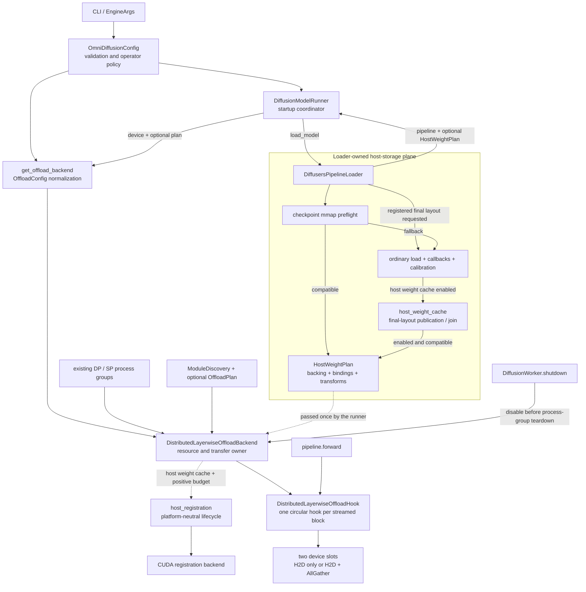
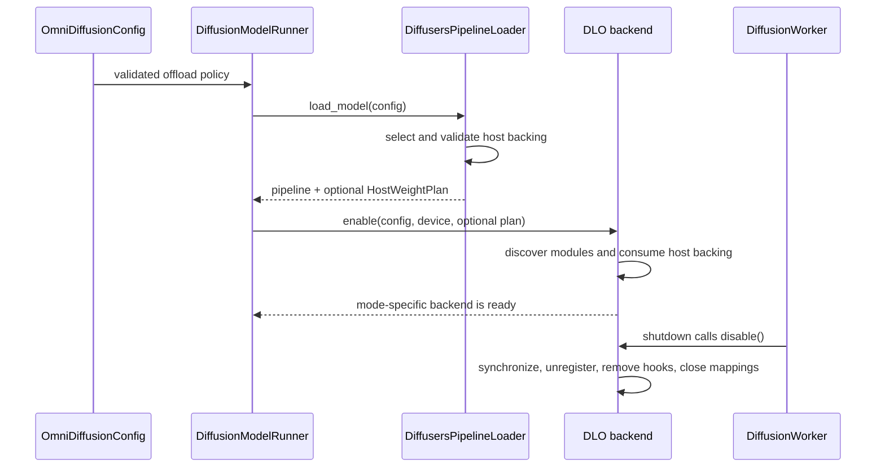
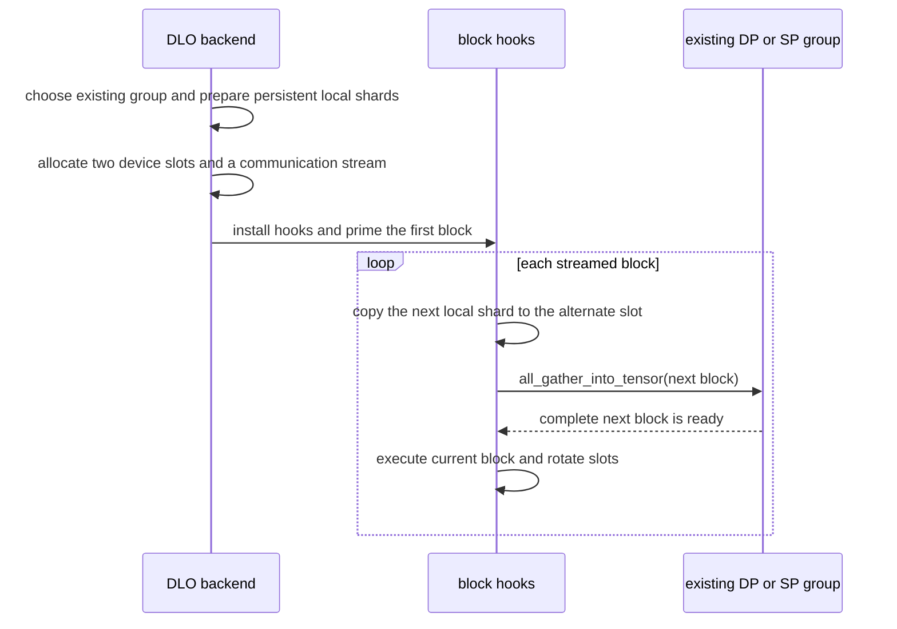
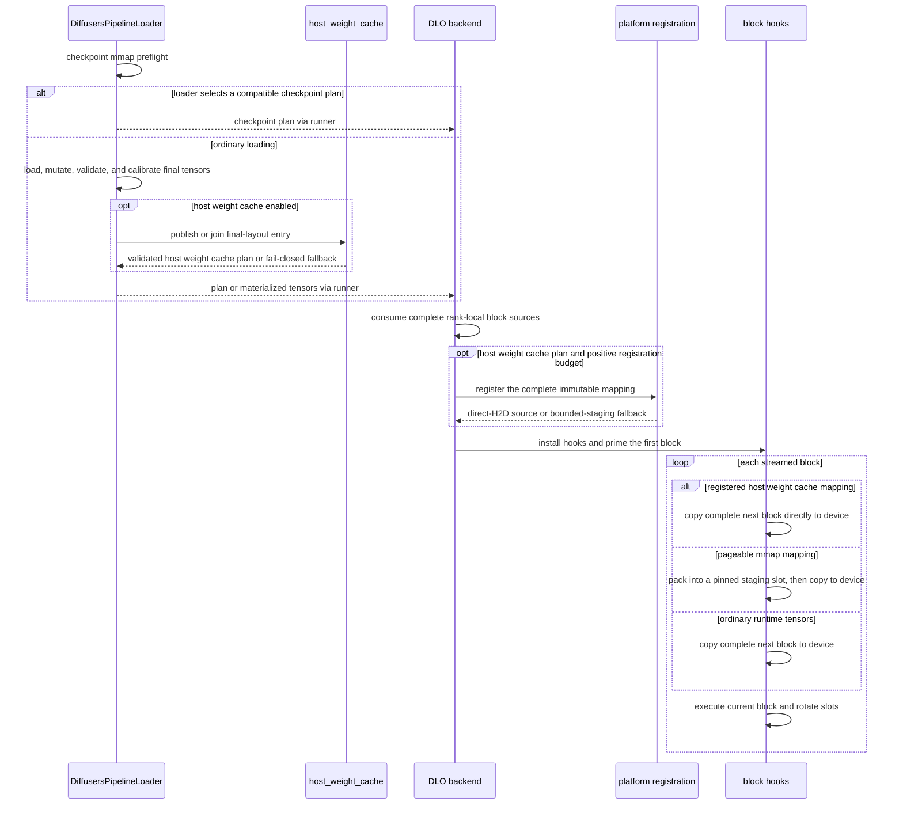
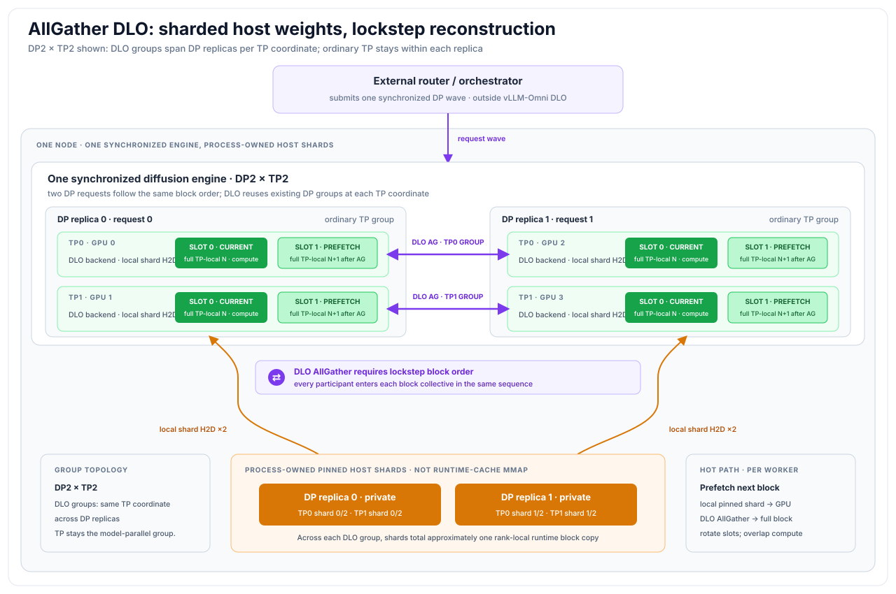
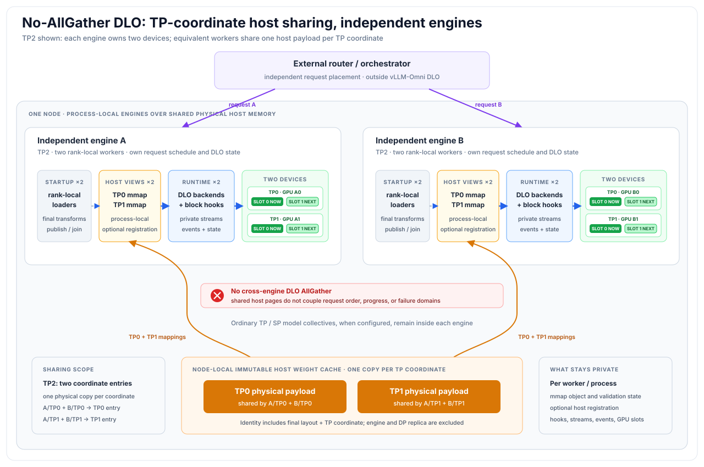

# Distributed Layerwise Offload

This document describes distributed layerwise offload (DLO) for diffusion
models. DLO keeps only a small number of DiT blocks on the accelerator and
streams the remaining blocks from host memory. The distributed backend can
either shard those host-side weights across an existing parallel group or keep
complete rank-local block sources and avoid an additional collective.

For user-facing commands, see the
[distributed layerwise offloading guide](../../../user_guide/diffusion/offloader/distributed_layerwise_offload.md)
and the [Cosmos3 recipe](https://github.com/vllm-project/vllm-omni/blob/main/recipes/cosmos3/Cosmos3-DistOffload.md).

## Status

DLO is implemented for multi-device diffusion execution. The default
AllGather path is the primary path for DP and SP deployments. The
`--dlo-no-use-allgather` path streams complete blocks independently and adds no
DLO weight collective.

Host storage is selected separately from the transfer protocol. The loader can
produce a direct-checkpoint mmap plan for a proven-compatible runtime layout;
otherwise it uses the ordinary loader. In no-AllGather mode, the Phase B host
weight cache automatically normalizes supported final ordinary-loader DiT
tensors into an immutable node-local mmap entry. Consequently, replicas can
share either proven-compatible checkpoint pages or equivalent final runtime
layouts. An opt-in host-registration budget can make the complete final mapping
directly H2D-copyable when the platform provides a backend, avoiding the
recurrent host packing otherwise required by mmap. CUDA is the first
implementation.

The Phase A shared-mmap support boundary is TP1. TP greater than one is an
ordinary-loader compatibility path: DLO can consume the resulting TP-local
tensors. Direct checkpoint mmap still does not cover TP, but the Phase B cache
can share each final TP coordinate among equivalent processes.

The compatibility matrix below defines the current implementation boundary.
Hardware and performance qualification is tracked separately from this
long-lived design contract.

## Architecture

DLO is divided into four planes: configuration, loader-owned host storage,
backend setup, and the per-block inference hot path. Keeping these decisions
separate is intentional. In particular, an mmap cache is a host-storage choice;
it does not imply a DLO AllGather, and disabling DLO AllGather does not decide
whether the host source is private memory, checkpoint mmap, or host weight cache
mmap. The shared control plane is described once below; the AllGather and
no-AllGather startup and hot paths are then shown separately.

### Component ownership

The map includes optional mode-specific components, but the ownership rules
and loader-to-backend boundary are shared.



| Component | Owns | Must not own |
| --- | --- | --- |
| CLI, engine arguments, and `OmniDiffusionConfig` | User policy, defaults, validation, and propagation to every worker | Checkpoint inspection, cache publication, or buffer allocation |
| `OffloadConfig.from_od_config()` | Offload-strategy selection, effective DLO group size, AllGather policy, resident-layer count, and registration budget | Host-weight compatibility decisions |
| `DiffusersPipelineLoader` | Ordinary loading lifecycle and the decision to return an optional `HostWeightPlan` | DLO process groups or block-stream scheduling |
| Checkpoint mmap planner | Proving that checkpoint tensors can represent the required runtime layout before ordinary DiT materialization is skipped | Host weight cache identity or transfer policy |
| `host_weight_cache` | Normalizing final ordinary-loader tensors into an immutable node-local entry and returning a validated plan | Model mutation, host registration, H2D, or collectives |
| `HostWeightPlan` | The one-way loader-to-offloader contract: backing kind, tensor bindings, source coverage, and any bounded transforms | Cache construction or runtime scheduling |
| `ModuleDiscovery` and model `OffloadPlan` | Discovering DiT/components and declaring block, resident, and on-demand paths | Loader or cache behavior embedded in model pipelines |
| `DistributedLayerwiseOffloadBackend` | Consuming the exact plan, selecting the existing group, mapping/repointing storage, allocating shared buffers and streams, optional host registration, installing hooks, and cleanup | Re-running loader compatibility checks or orchestrating replicas |
| `DistributedLayerwiseOffloadHook` | The block hot path: prefetch, optional DLO AllGather, readiness events, parameter repointing, and replacement with offload placeholders | Cache keys, manifest validation, or request routing |
| `host_registration` and platform backend | All-or-nothing registration lifecycle for existing immutable mappings | Choosing which weights are cached or changing the two-slot device-buffer contract |
| `DiffusionWorker` | Calling backend teardown before destroying the distributed environment | Managing backend-owned mappings or registrations directly |

The configuration fields are routed to the component that can enforce their
contract. The cache root and lock timeout are consumed by the loader.
`dlo_host_weight_cache_pin_limit_gib` is also visible while loading because a
positive value deliberately selects the transform-complete host weight cache;
the backend later consumes the same budget for registration.
`dlo_use_allgather` controls loader plan routing because the host weight cache
is no-AllGather-only, and it selects the backend transfer protocol. This is
coordination through typed configuration and `HostWeightPlan`, not through
model-specific global state.

### Shared startup and lifecycle

The shared control path selects host backing and transfers its ownership to
the backend before either transfer mode installs hooks:



The loader returns a plan only after its contract is valid: checkpoint plans
have preflight-proven source coverage and metadata, while host weight cache
plans also have full manifest, file, and mapped-content validation. The runner
then transfers ownership exactly once with
`model_loader.take_host_weight_plan()`. If no plan is returned, the backend
requires materialized ordinary-loader tensors. If a plan caused ordinary DiT
materialization to be skipped, failure to create or enable its consumer is a
hard startup error rather than a fallback to uninitialized parameters.

At inference time, the model pipeline remains the caller: normal block forward
calls activate the installed hooks. Both modes use one copy stream and two
shared device slots sized for the largest streamed block. The hooks do not
call the loader or cache.

### AllGather startup and hot path



AllGather uses the existing DP group when DP is greater than one, otherwise
the existing SP group when SP is greater than one. TP is never selected as
DLO's weight-sharding group. Every participating rank must request blocks in
the same order; fast P2P reduces communication cost but does not remove that
lockstep contract. An effective group size of one issues no collective and
uses rank-local transfer.

### No-AllGather startup and hot path



No-AllGather creates no DLO weight group and issues no DLO collective.
Workers may therefore schedule requests independently. Ordinary TP and SP
collectives remain inside model execution; host registration changes only
the source of the complete-block H2D copy.

### Host backing and transfer composition

| Loader-selected host backing | Backend transfer mode | Setup result | Per-block hot path |
| --- | --- | --- | --- |
| Ordinary runtime tensors | AllGather group larger than one | Each rank retains a pinned local weight shard | shard H2D → DLO AllGather → device slot |
| Checkpoint mmap | AllGather group larger than one | Each rank prepares its persistent shard, then releases the source mapping | shard H2D → DLO AllGather → device slot |
| Ordinary runtime tensors | Rank-local / no-AllGather | Each rank retains the complete loader-produced local layout | complete-block H2D → device slot |
| Checkpoint or host weight cache mmap, zero registration budget | Rank-local / no-AllGather | Immutable mapping plus two bounded pinned host-staging slots | mmap views → pinned staging slot → device slot |
| Host weight cache mmap, positive registration budget | Rank-local / no-AllGather | Complete mapping is registered by the platform backend | registered mmap views → device slot |

The three axes therefore remain independent:

1. **Offload policy:** whether DLO is enabled and which layers are resident.
2. **Host backing:** ordinary tensors, checkpoint mmap, or final host weight cache
   mmap, selected by the loader.
3. **Transfer protocol:** rank-local H2D or H2D plus DLO AllGather, selected by
   the backend from validated configuration and existing topology.

### Failure and lifecycle boundaries

- Invalid option combinations fail during configuration validation.
- Checkpoint mmap preflight failure falls back before ordinary loading is
  skipped.
- Host weight cache incompatibility, timeout, or publication failure retains
  the already-valid ordinary tensors.
- Host-registration failure rolls back and retains bounded staging. A rollback
  failure aborts startup because unmapping a range still owned by the platform
  would be unsafe.
- During shutdown, DLO synchronizes outstanding device work, unregisters host
  mappings, removes hooks, and closes mmap handles only after safe unregister;
  the worker destroys its process groups afterward.

DLO deliberately does not own DP replica placement, independent-engine request
routing, cross-engine admission control, or cross-node cache distribution.
Those belong to an external router/orchestrator. It also does not replace TP or
SP model collectives; it only adds an optional weight collective over an
already-existing DP or SP group.

## Shared design

The following topology and loader contracts apply to both transfer modes.

### DLO consumes the existing parallel topology

DLO does not create a new DP, TP, or SP topology. It reads the configured
`DiffusionParallelConfig` and attaches offload hooks to the DiT blocks after the
standard distributed groups have been initialized.

AllGather mode selects one existing group for DLO weight sharding; no-AllGather
mode creates no DLO group. Neither mode changes ordinary TP or SP model
collectives. The mode-specific group and scheduling contracts are described
below.

### The loader owns host-weight planning

Before it decides whether ordinary weight materialization can be skipped, the
diffusion loader builds one `HostWeightPlan`. A direct-checkpoint mmap plan is
accepted only when preflight proves all of the following:

- every required DiT parameter and persistent buffer has exactly one source;
- runtime names, checkpoint keys, shapes, and dtypes match;
- the runtime topology is TP1 without HSDP or online quantization; and
- every custom loader operation is represented by a loader-owned checkpoint
  adapter.

The exact plan object is handed to DLO. The backend does not rescan checkpoint
files, repeat the capability decision, or reconstruct names from its block
topology. If preflight fails, the loader materializes weights normally and DLO
consumes those runtime tensors.

The plan owns only dedicated DiT component sources. If a pipeline also exposes
ordinary sources for a text encoder or another non-DiT component, the loader
still consumes those sources and includes their loaded names in its strict
coverage check. Only the source prefixes covered by the plan skip ordinary
materialization. A source that mixes DiT and non-DiT weights fails closed to
the complete ordinary-loader path because it cannot be skipped safely as a
unit.

This boundary keeps checkpoint semantics out of DLO and avoids model-pipeline
flags such as `_supports_mmap_loading` or parameter attributes for mmap-only
transforms. Model-specific direct-layout knowledge, when required, lives in a
checkpoint adapter beside the ordinary loader.

## AllGather design

### Group selection

The DLO weight-sharding group is selected in this order:

1. Use the existing DP group when `data_parallel_size > 1`.
2. When DP is one and SP is greater than one, use the existing SP group.
3. Otherwise, use an effective group size of one and issue no collective.

TP is deliberately not used as DLO's AllGather group. HSDP has its own
parameter-sharding lifecycle and cannot be sharded a second time by DLO.

### Sharded transfer and double buffering

The loader may provide ordinary runtime tensors or a compatible checkpoint
plan. During backend setup, either source is normalized into persistent local
shards. The final-layout host weight cache is not selected in AllGather mode.

With the default `dlo_use_allgather=True`, each rank stores approximately
`1 / group_size` of each streamable block in pinned host memory. The next
block's shard is copied to a device buffer and reconstructed with
`all_gather_into_tensor` on a communication stream while the current block is
executing.



The figure uses DP2 with TP2 to expose both parallel dimensions. DLO creates
one AllGather group across the DP replicas for each TP coordinate; TP0 workers
reconstruct TP0 blocks together and TP1 workers reconstruct TP1 blocks
together. Ordinary TP collectives remain inside each DP replica. Unlike the
no-AllGather host weight cache path, these persistent pinned host shards are
process-owned, and every participating rank must follow the same block order.

```text
Compute:    [Block N]             [Block N+1]          [Block N+2]
H2D:                      [shard N+1]           [shard N+2]
AllGather:                [full N+1]             [full N+2]
Buffers:    [current slot]       [prefetch slot]       [current slot]
```


The backend uses two shared device buffers, so accelerator weight residency is
bounded by the largest streamed blocks rather than the complete model.

When direct checkpoint mmap is selected, the checkpoint mappings are only the
source used to prepare each rank's persistent shard. They can be closed after
shard preparation. Across the AllGather group, those private shards total
approximately one runtime model copy.

An effective DLO group size of one performs no collective, even when
`dlo_use_allgather=True`; it follows the rank-local transfer path described
below.

When DP is greater than one, the engine can process one request per DP rank in
the same denoising wave. Because AllGather is a collective, all participating
requests must take the same execution path at every denoising step.

Fast NVLink/NVSwitch changes collective cost, not this execution contract. For
independently scheduled replicas—even on one NVSwitch baseboard—no-AllGather
plus shared mmap storage avoids coupling their request schedules and failure
domains.

## No-AllGather design

### Rank-local transfer

With `--dlo-no-use-allgather`, DLO forces its internal offload shard size to
one and streams complete blocks using H2D copies only. The host backing may be
a loader-approved checkpoint mapping, a normalized host weight cache mapping, or
ordinary runtime tensors.



The figure uses TP2 to make per-coordinate physical sharing explicit. Each
engine contains two rank-local workers and devices. The cache keeps one
immutable entry per TP coordinate, so equivalent TP0 workers across engines
share the TP0 entry and equivalent TP1 workers share the separate TP1 entry.
An external router or orchestrator chooses each engine's requests; DLO
coordinates only the worker-local mapping, hooks, transfer streams, events,
and device slots.

For direct mmap, each process retains immutable safetensors views and uses two
bounded pinned host staging slots. Processes on the same node that map the same
files share physical checkpoint pages through the OS page cache. This removes
the persistent private full-model copy per pure-DP process, but each process
still packs and transfers every complete block. Sharing is node-local; each
node has its own page cache.

For a host weight cache mapping, a positive registration budget replaces those
host slots with direct copies from the shared final tensor views. A zero budget
or failed registration retains the bounded staging behavior.

When direct mmap preflight fails, the regular model loader remains responsible
for preparing each rank's weights, including TP-local tensors or HSDP-managed
parameters. Supported CPU layouts then enter the host weight cache
automatically. Unsupported layouts keep one private runtime copy per process.

This mode means:

- DP still provides independent replicas, but DLO does not shard weights
  across DP ranks.
- SP still performs its normal activation/attention collectives, but DLO does
  not shard weights across SP ranks.
- TP/HSDP/SP collectives, if configured, are not disabled by this flag; only
  DLO's additional weight AllGather is disabled.
- Pure DP deployments share one checkpoint-backed copy per node when direct
  mmap is selected. The host weight cache can share equivalent ordinary-loader
  outputs; its fallback keeps one private runtime copy per rank.
- The scheduler does not require a synchronized DP request wave for DLO.

### Post-load host weight cache

The Phase B cache preserves the same ownership boundary. DLO neither derives
cache keys nor interprets model loaders. No-AllGather DLO first attempts a
compatible direct-checkpoint mmap plan. When that plan is unavailable, every
rank completes the ordinary loader, custom callbacks, post-load processing,
strict validation, and calibration. The loader then automatically:

1. discovers final CPU DiT parameters and persistent buffers;
2. rejects unsupported non-contiguous, aliased, quantized, distributed, or
   ambiguous layouts before changing the model;
3. hashes tensor names, metadata, and final bytes;
4. builds or joins one content-addressed entry under a strict POSIX lock; and
5. returns a `HostWeightPlan(backing_kind="host_weight_cache")` only after file,
   manifest, and remapped-tensor content validation succeeds.

The identity excludes DP size/rank and SP rank. It includes TP world size/rank
and conservative SP implementation/world-size guards. DP replicas and
equivalent SP ranks can therefore share; different TP coordinates cannot.
Final tensor content is authoritative, so an unmodeled loader/config change
that changes bytes creates a different entry instead of risking silent
sharing.

Publication writes sharded safetensors and a JSON manifest into a same-
filesystem temporary directory, flushes them, and atomically renames the
directory. The manifest includes per-file SHA-256 digests and the final tensor
content digest. Kernel `flock` ownership distinguishes a live writer from a
stale lock file: process death releases the lock automatically. Stale temporary
entries are removed only by the next lock owner. A bounded wait or any cache
error retains the already-valid ordinary tensors.

DLO maps this plan without moving the DiT to `meta` and without rerunning any
post-load hook. It changes tensor storage while preserving `Parameter` objects,
then runs the existing `gc.collect()`/`malloc_trim()` cleanup before installing
streaming hooks. The source mappings remain open through DLO disable. With the
default zero registration budget they feed the existing bounded two-slot host
staging path. Every streamed block is first packed from pageable mmap storage
into one of those pinned slots and is then copied to the device. This removes
model-sized private pinned storage, but adds a recurrent host-to-host copy and
can amplify TP synchronization waits when several ranks compete for host
bandwidth.

This version is deliberately steady-state-oriented. It requires roughly one
local-disk model copy per runtime identity, has no eviction, and still performs
ordinary loading plus full content-hash passes in every rank. Cache publication
or validation failure falls back to the already-valid ordinary host tensors.
Skip-load-on-hit is a separate follow-up after loader side effects can be
modeled safely.

### Registered host weight cache transfer

`dlo_host_weight_cache_pin_limit_gib > 0` opts a worker into registration of
the complete host weight cache mapping when its platform supports it. It also
changes loader selection: no-AllGather uses the ordinary loader and
final-layout host weight cache even when a TP1 direct-checkpoint plan is
available. A checkpoint binding can carry a deferred adapter such as
grouped-QKV reordering. Registering that raw source would not remove the
adapter's recurrent CPU allocation/copy, whereas the host weight cache contains
the transform-complete final tensors.

After mapping and validating every final tensor, DLO groups source storages by
backing file, page-aligns their address ranges, and coalesces overlapping or
adjacent ranges within that mapping. The complete byte count is checked
against the per-worker budget before any platform mutation. The CUDA backend
then registers every range with the read-only host-registration flag and
verifies that PyTorch recognizes every mapped tensor as pinned. Failure rolls
back any ranges already registered and preserves the existing two-slot staging
path. Partial direct transfer is deliberately unsupported. A rollback failure
aborts worker initialization so a still-registered range is retained until
process/context teardown rather than being unsafely unmapped.

On success, the hooks copy each immutable tensor view directly into its offset
in the existing flattened rotating device buffer on the copy stream. Parameter
repointing, two-block HBM residency, and H2D/compute overlap are unchanged. The
direct path trades recurrent host packing for finer-grained H2D operations. A
packed cache schema should be considered only if that additional format and
publication complexity becomes necessary.

Registration is per process and platform context; physical file-cache pages
remain shared and are not copied into one private host allocation per worker.
The operator must nevertheless budget page-locked memory and satisfy the
platform and OS registration limits for every worker. During shutdown, DLO
first synchronizes outstanding device work, unregisters all ranges, and then
closes the safetensors mappings. Worker teardown invokes this cleanup before
destroying the distributed environment and platform context.

## Parallelism compatibility

| Parallelism | DLO + AllGather | DLO without AllGather |
|---|---|---|
| **DP** | Supported primary path. DLO shards host weights across the DP group and can run DP multi-concurrency. | Supported rank-local path. Compatible TP1 replicas can share checkpoint pages; the optional host weight cache shares equivalent final layouts while excluding DP rank from its identity. CUDA workers may register the complete final mapping for direct H2D. |
| **SP** | Supported in the implementation. With DP=1, DLO uses the SP group for host-weight sharding; SP still shards sequence/activation work. | SP remains active without a DLO weight collective. Host weight cache v1 excludes SP rank and includes conservative SP implementation/world-size guards. Registered transfer does not remove ordinary SP activation/attention collectives. |
| **TP > 1** | Outside the Phase A direct-mmap scope. The loader preserves TP-local layouts and DLO may apply DP/SP host sharding to ordinary runtime tensors. | The ordinary TP-aware loader produces rank-local tensors. Host weight cache v1 creates one entry per TP coordinate, shareable by equivalent DP/SP processes. Registering those final mappings avoids the recurrent staging copy but does not remove ordinary TP collectives. |
| **HSDP** | Rejected. HSDP has already sharded parameters, so DLO AllGather would double-shard them. | Accepted only with ordinary-loader rank-local tensors. HSDP owns parameter sharding and its own gathers; host weight cache v1 rejects HSDP/DTensor layouts. |

### Combined dimensions

- **DP + SP:** DLO uses the DP group for weight sharding when DP is greater
  than one; SP continues to use its own sequence-parallel group. If DP is one,
  the SP group becomes DLO's sharding group in AllGather mode.
- **DP + TP/SP without AllGather:** standard model loading defines the
  rank-local tensor layout. DLO adds no cross-DP, cross-TP, or cross-SP weight
  collective.
- **HSDP + SP:** the general parallel configuration permits HSDP over SP, but
  DLO must use `--dlo-no-use-allgather`. HSDP remains responsible for weight
  materialization and synchronization.
- **HSDP + DP or TP:** rejected independently by the diffusion parallel
  configuration.

## Mode constraints

### AllGather constraints

AllGather DP multi-concurrency requires:

- explicit `num_inference_steps`;
- the same `num_inference_steps` for all requests in a wave; and
- identical request arguments that affect the collective execution path.

Online quantization remains incompatible with DLO AllGather; use
`--dlo-no-use-allgather` or disable online quantization.

### No-AllGather constraints

The no-AllGather path does not impose these DLO-specific synchronized-wave
requirements. Host weight cache v1 is no-AllGather only and rejects all
quantization configurations, HSDP/DTensor, expert parallelism, CFG
parallelism, PP, non-contiguous tensors, and tied/shared storage.

### Shared loading constraint

Direct checkpoint mmap can back either transfer path. It is currently limited
to proven TP1, non-HSDP, non-online-quantized layouts. Other layouts use the
ordinary loader.

## Validation status

Historical test counts and hardware measurements are intentionally not kept
in this design document because they can drift as the implementation changes.
Revalidation must run against the final commit and publish commit-pinned
artifacts before making hardware or performance claims. Track that work in
[issue #6231](https://github.com/vllm-project/vllm-omni/issues/6231).

## Recommendations

### AllGather

- Use **DP + DLO AllGather** when ranks already execute the same block path in
  lockstep and belong to the same fast P2P domain. It shards persistent host
  weights across that group.
- Use **SP + DLO AllGather** for long-sequence workloads when DP concurrency is
  not the goal.

### No-AllGather

- Use **no-AllGather** when independent replica execution is required. TP1
  direct-mmap deployments can share checkpoint pages per node. Enable the
  host weight cache only when independent replicas have repeated final layouts
  and benchmark the target CPU/memory topology, especially for matching
  coordinates across multiple TP engines. On CUDA, provide an explicit
  registration budget large enough for the complete final layout when
  recurrent staging cost is unacceptable; leave it at zero when page-locking
  that layout is not operationally acceptable.

### HSDP

- Do not combine HSDP with DLO AllGather or host weight cache v1. HSDP with
  no-AllGather remains an ordinary-loader rank-local path.
